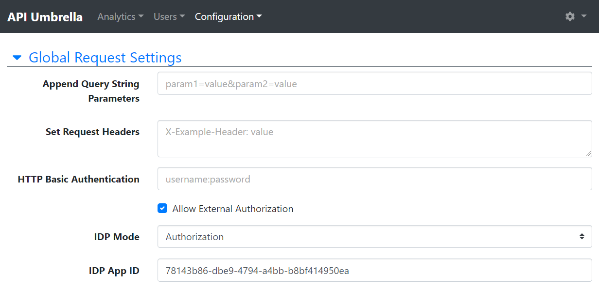

# 1 API Umbrella
API Umbrella is an open source API management platform for exposing web service APIs. The basic goal of API Umbrella is to make life easier for both API creators and API consumers. API creators can handle their API's access with different request headers or use the Keyrock identity management component for more specific access control.

## 1.1 Initial setup
After the previous document where Docker-Compose was configured and been set up, it is time to do the initial setup of API Umbrella.

### 1.1.1 First login
After starting up the API Umbrella, the application is found at umbrella.domain.cc/admin

**NOTE:** If the application doesn't show first login page, delete `mnt` folder and try again by deleting all containers and starting them up with
> docker-compose down
> 
> docker-compose up

# 2 Backends
API Umbrella routes other applications by adding backends with its' UI. This means that other applications can be accessible through API Umbrella, from HTTPS 443 port.

This guide shows how the Orion Context Broker and Keyrock Identity Management components are added into API Umbrella

## 2.2 Adding a Website Backend
1. To add a Website Backend, it can be done at https://umbrella.domain.cc/admin/#/website_backends or **`Configuration` > `Website Backends`**

   

2. Clicking blue button with `Add Website Backend` at right side of page proceeds into new page with different fields. It is necessary to fill all fields with values of this guide's picture

   **NOTE:** Add the `umbrella.domain.cc` into `Frontend Host` field!

   

## 2.3 Adding an API Backend
1. To add an API Backend, it can be done at https://umbrella.domain.cc/admin/#/apis or **Configuration > API Backends**

   

2. Clicking blue button with `Add API Backend` at right side of page proceeds into new page with different fields. It is necessary to fill all fields with values of this guide's pictures

   

   **NOTE:** Add the `umbrella.domain.cc` into `Frontend Host` field!
   
   
   
   **NOTE:** `IDP App ID` is obtained later!
   
   
   
   

3. Publishing changes

   To publish new Website and API Backend, it can be done at https://umbrella.domain.cc/admin/#/config/publish or **Configuration > Publish Changes**

   

# 3 Next steps
Next step is to configure the Keyrock component. 

[Keyrock setup guide](keyrock-setup.md)

# 4 References
- [Documentation](https://api-umbrella.readthedocs.io/en/latest/)
- [Github](https://github.com/FIWARE/api-umbrella)
- [API Management](https://en.wikipedia.org/wiki/API_management)
