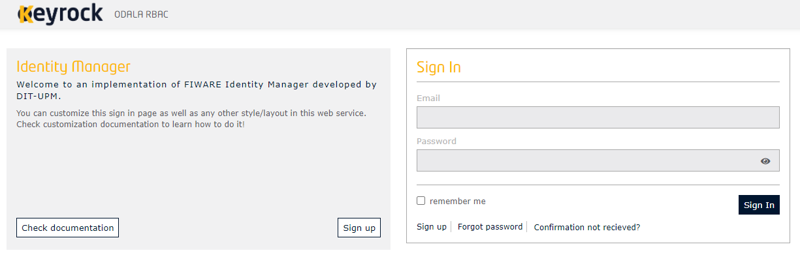
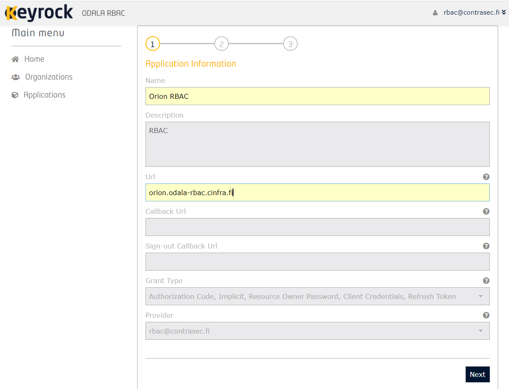
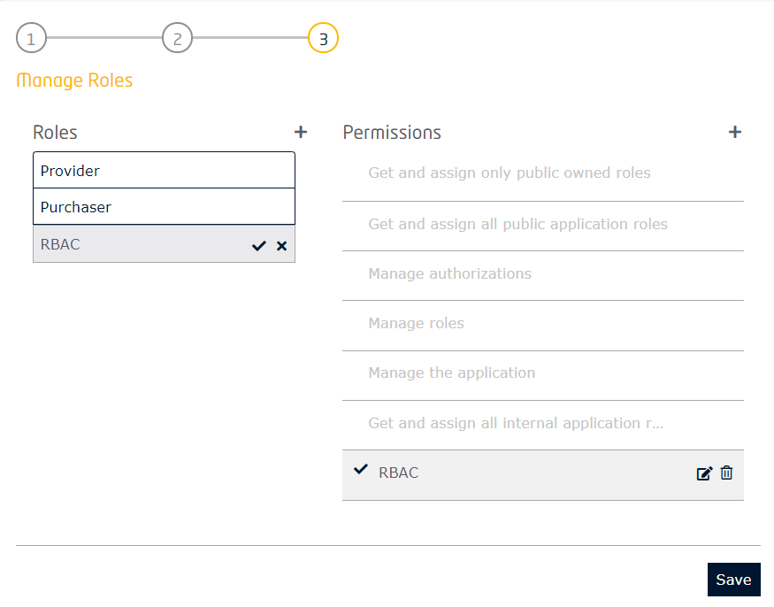
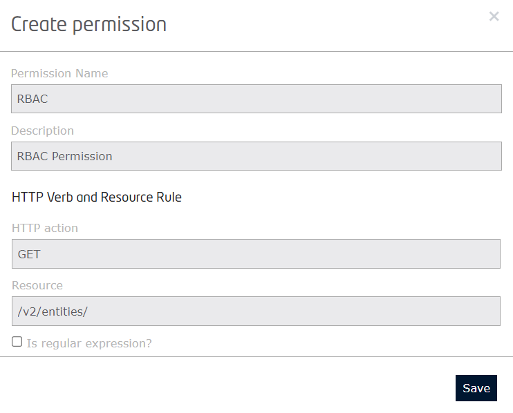
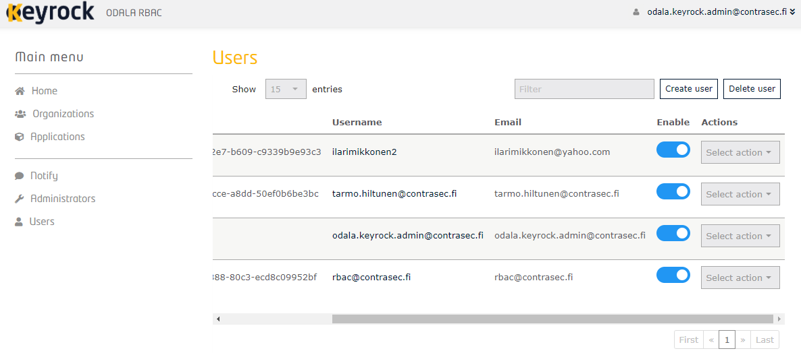
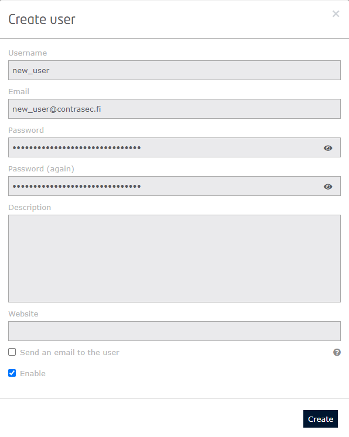
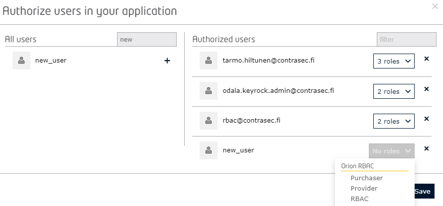
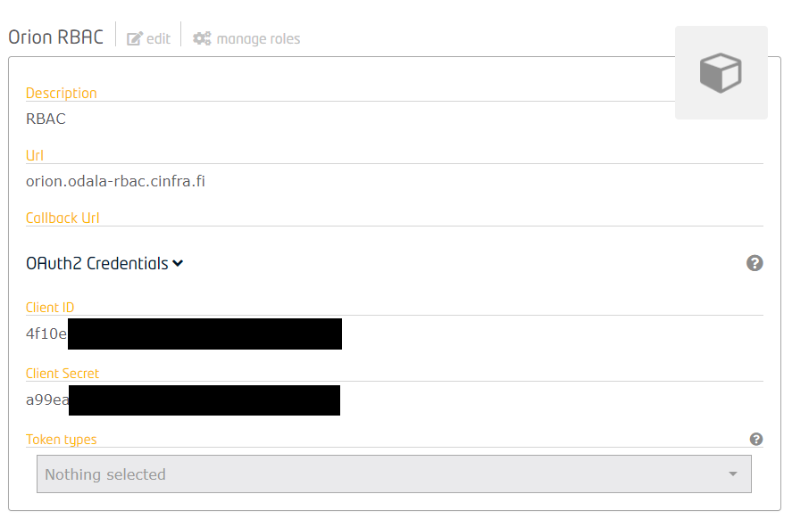
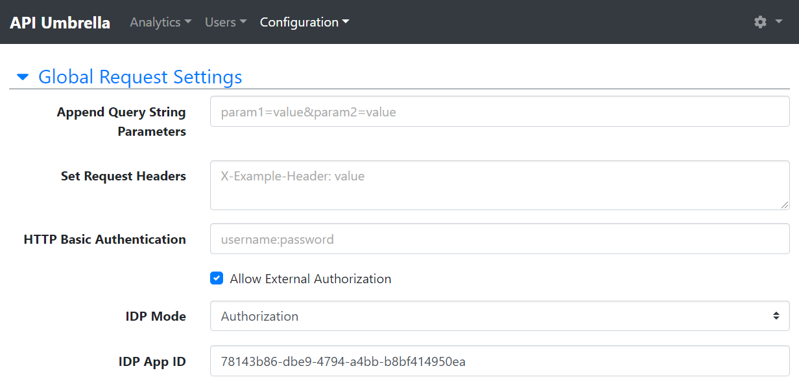

# 1 Keyrock
Keyrock is the FIWARE component responsible for Identity Management. Using Keyrock (in conjunction with other security components such as PEP Proxy and Authzforce) enables you to add OAuth2-based authentication and authorization security to your services and applications.

# 2 Setup

Keyrock is accessible through API Umbrella, at https://accounts.domain.cc/



Admin credentials are in `docker-compose.yml` file, lines 72 and 74:
```
72                - IDM_ADMIN_USER=USER
73                - IDM_ADMIN_EMAIL=EMAIL
74                - IDM_ADMIN_PASS=PASSWORD
75                - IDM_TITLE=ODALA RBAC
```

# 2.1 Registering an application
To register an application into Keyrock, it can be done at https://accounts.domain.cc/idm/applications/new or clicking `Register` button in the `Applications` box.

**NOTE:** In this example, Orion Context Broker is added into Keyrock. 



In the `Manage Roles` page, new roles and permissions can be made by clicking `+` characters. Clicking `Save` Keyrock saves the new application into database and it can be used.

**NOTE:** It is required to activate permissions by clicking them. Keyrock will confirm with a confirmation sign





# 2.2 Creating new user
To utilize registered application, a user is needed. To create new user, it can be done at https://accounts.domain.cc/idm/admins/list_users or clicking `Users` in `Main menu` list.

Clicking `Create user` displays a pop-up window where the new user's information can be added. Clicking `Create` will save user into database



**NOTE:** If there isn't any SMTP server configured into setup, it is necessary to enable the new user




# 2.3 Authorizing user for application
Authorizing user for application is done at previously created application's page. There is a `Authorized users` box with `Authorize` button. Clicking button will display a pop-up window with users and roles

To assign a role for new user, user must be found by searching it via grayed input box. Clicking `+` will authorize new user. Role must be given to this user by opening drop-down list and selecting a role.



# 3 OAuth2 credentials
OAuth2 credentials are used for authentication and must be added into API-Umbrella. OAuth2 credentials are found at application page.

API Umbrella needs `Client ID` in order to get the RBAC working. `Client ID` is for `IDP App ID` field

**NOTE:** API-Umbrella setup is found there: [API Umbrella - Adding an API Backend](https://github.com/contrasec-fi/Odala-rbac/blob/documentation/api-umbrella.md#23-adding-an-api-backend)





# 4 References
- [Keyrock documentation](https://fiware-idm.readthedocs.io/)
- [API Umbrella documentation](https://api-umbrella.readthedocs.io/en/latest/)
- [OAuth2](https://oauth.net/2/)
